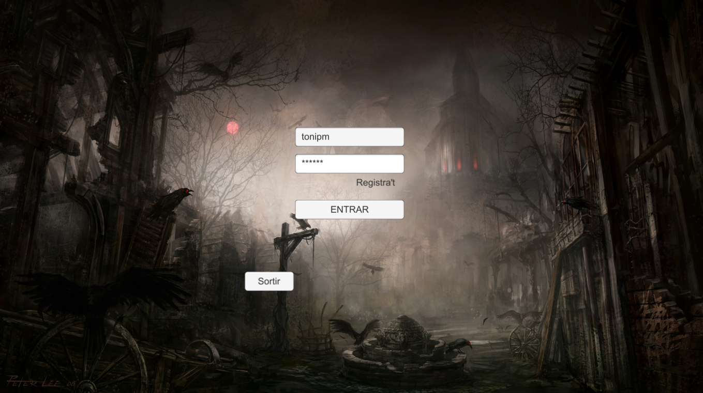
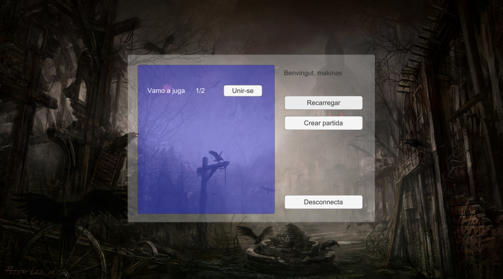
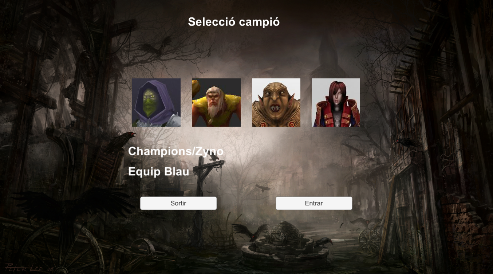
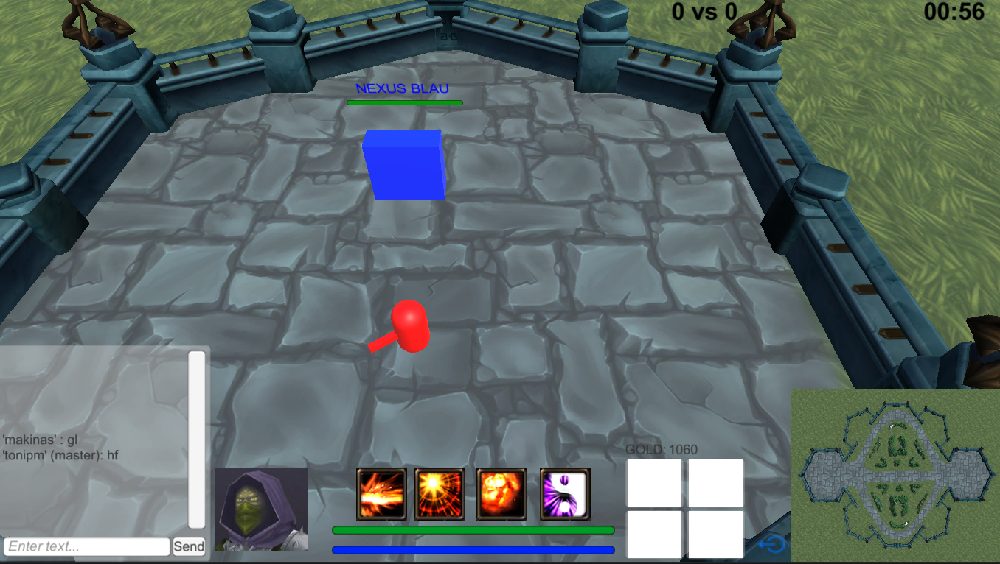

MOBA Game | Unity | 2017
===========================

Project done in class in 2017. I hope to be able to continue it one day.

After more than 5 years it still "works".

- **Can only be played on a local network.**
- **Authentication server has been disabled, so you can login without register, just enter a nickname.**
- **Character renders have been disabled, now they are colored cylinders 😂**

Inside `Builds` folder you can find `zip` files for each version, these compressed files includes the builds with an `exe` to execute the game.

To play:

- Sign in with a cool nickname
- Create a room or join an existing one
- Choose character
- Wait for the rest of the players
- Start game
- Win

The game consists in destroy the enemy nexus, for this you must cooperate to eliminate their defensive towers first.

You will find neutral enemies scattered around the map.

Some images:

*Made with Unity.*